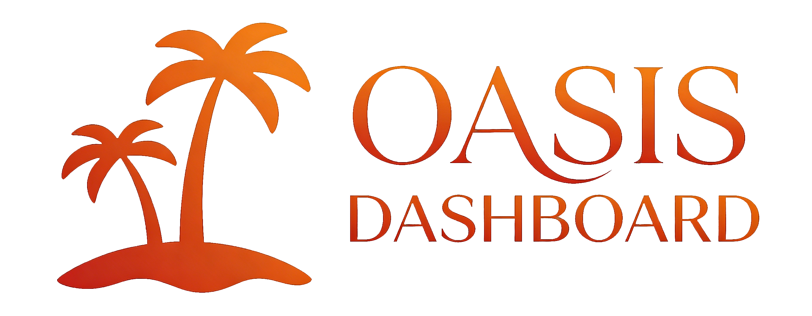

<div align="center">



# OASIS Dashboard

**A Professional Web Platform for OASIS Simulation Engine Monitoring and Control**


</div>

---

## Overview

**OASIS Dashboard** is an enterprise-grade web application designed for real-time monitoring and control of the **OASIS (Open-ended Autonomous Social Intelligence Simulation)** engine. It provides an intuitive interface for configuring, executing, and analyzing complex social simulation experiments with support for local large language models (e.g., Qwen3-8B).

---

## Features

### 🎯 Core Capabilities

- **Real OASIS Engine Integration**: Built on the authentic `camel-oasis` framework, ensuring simulation accuracy and depth
- **Local Model Support**: Run local LLMs via Ollama (Qwen3-8B) without external API dependencies, reducing costs and protecting data privacy
- **Real-time Monitoring**: Live tracking of simulation status, KPI metrics (active agents, total posts, polarization index), and agent activities
- **Dynamic Control**: Adjust parameters, inject events, and intervene in agent behaviors during simulation runtime
- **Advanced Visualization**: Social network graphs, trend analysis, and geospatial heatmaps for intuitive data understanding
- **User Persona Generation**: Create culturally nuanced agent profiles based on real-world datasets (e.g., Reddit)
- **Comprehensive Logging**: Detailed recording and analysis of each agent's decision-making process and interactions
- **Group Chat Monitoring**: Observe group discussions, opinion formation, and coordination behaviors
- **Modular Architecture**: Clean separation of frontend and backend for easy extension and development

---

## Tech Stack

### Frontend


### Backend


### Simulation Engine


### Tools & Platforms


| Category | Technology |
|----------|-----------|
| **Frontend** | React 19, TypeScript, Vite, TailwindCSS, Recharts, Framer Motion |
| **Backend** | Node.js, Express, Socket.io, TypeScript |
| **Simulation Engine** | Python 3.11+, CAMEL-AI, Ollama, Qwen3-8B |
| **Database** | SQLite (built-in with OASIS) |
| **State Management** | Zustand, TanStack Query |
| **UI Components** | Lucide Icons, Sonner |

---

## Performance

| Metric | Value | Description |
|--------|-------|-------------|
| Qwen3-8B Load Time | 0.26s | Initial model loading |
| OASIS Initialization | 9.75s | Per agent |
| Step 1 Execution | 1.08s | With real LLM calls |
| Step 2-5 Average | 0.14s | With real LLM calls |
| Timeout Limit | 30s | Optimized for UX |

---

## Getting Started

### Prerequisites

- **Operating System**: Ubuntu 22.04 LTS (recommended)
- **Hardware**: 4+ core CPU, 8GB+ RAM, 40GB+ storage
- **Software**: Node.js 20+, Python 3.11+, Ollama

### Installation

1. **Clone Repository**
   ```bash
   git clone https://github.com/swjtu-dev-squad/oasis-dashboard.git
   cd oasis-dashboard
   ```

2. **Install Dependencies**
   ```bash
   # Install Node.js dependencies
   pnpm install

   # Install Python dependencies
   uv sync
   ```

3. **Configure Local Model**
   ```bash
   ollama pull qwen3:8b
   ```

4. **Start Development Server**
   ```bash
   pnpm dev
   ```

5. **Build for Production**
   ```bash
   pnpm build
   NODE_ENV=production npx tsx server.ts
   ```

---

## Documentation

- **[Installation & Configuration Guide](docs/INSTALL_AND_CONFIG_MANUAL.md)**: Detailed setup instructions
- **[Developer Guide](docs/DEVELOPER_MANUAL.md)**: Code structure, API documentation, and development guidelines
- **[OASIS Architecture](docs/OASIS_AND_ARCHITECTURE.md)**: System architecture and design principles

---

## Scripts

```bash
# Development
pnpm dev              # Start development server
pnpm dev:log          # Start with logging enabled
pnpm build            # Build for production
pnpm preview          # Preview production build
pnpm lint             # Run TypeScript checks
pnpm clean            # Clean build artifacts
```

---

## Project Status


This project is currently under active development and has not yet been deployed to production environments.

---

## Metrics


---

## Resources


- **[CAMEL-AI OASIS](https://github.com/camel-ai/oasis)**: Core simulation framework
- **[Ollama](https://ollama.ai)**: Local LLM runtime
- **[Qwen](https://github.com/QwenLM/Qwen)**: Large language model

---

<div align="center">


**Built with ❤️ by SWJTU Development Squad**

</div>
