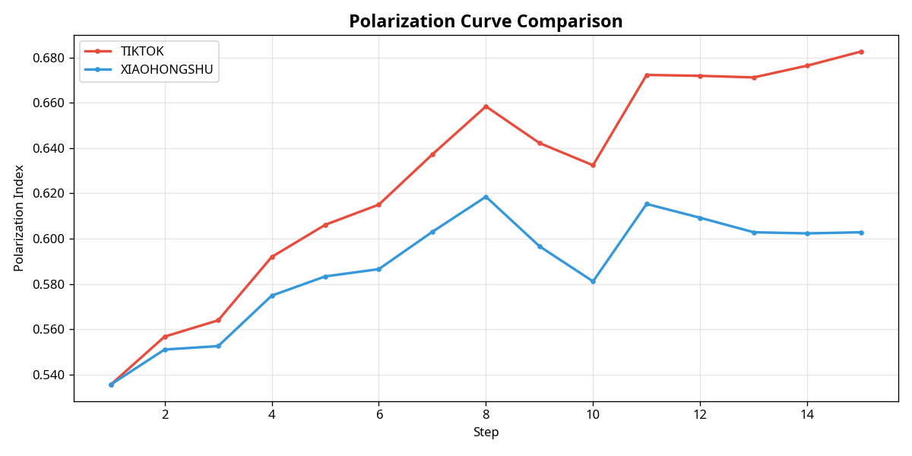
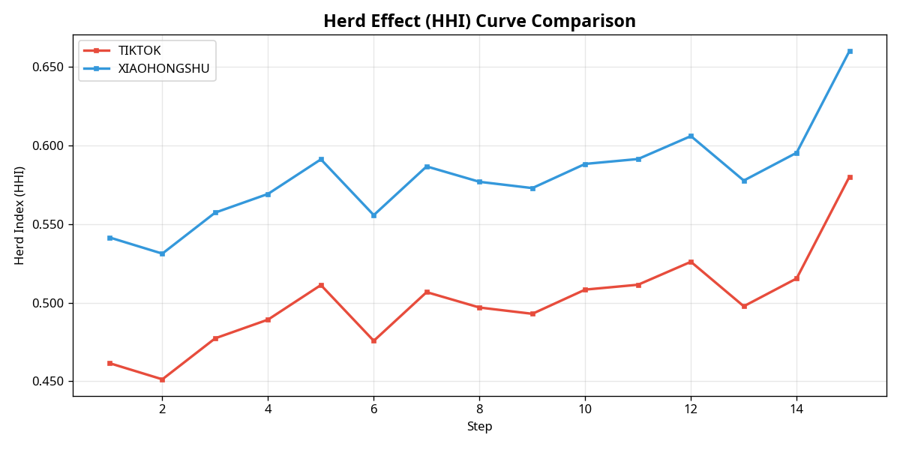
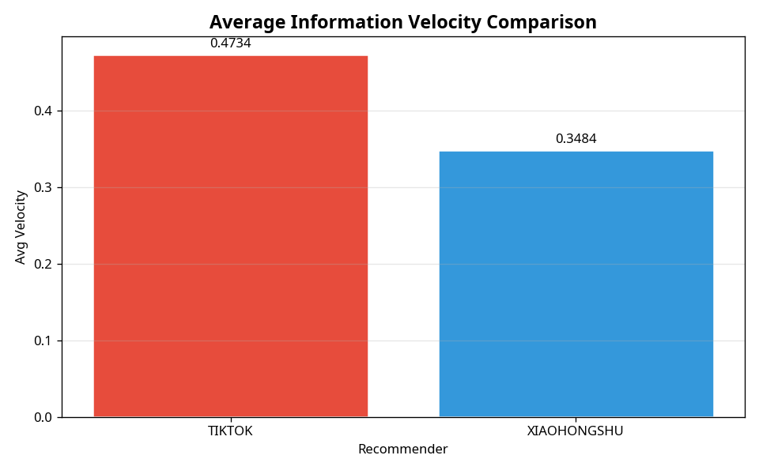
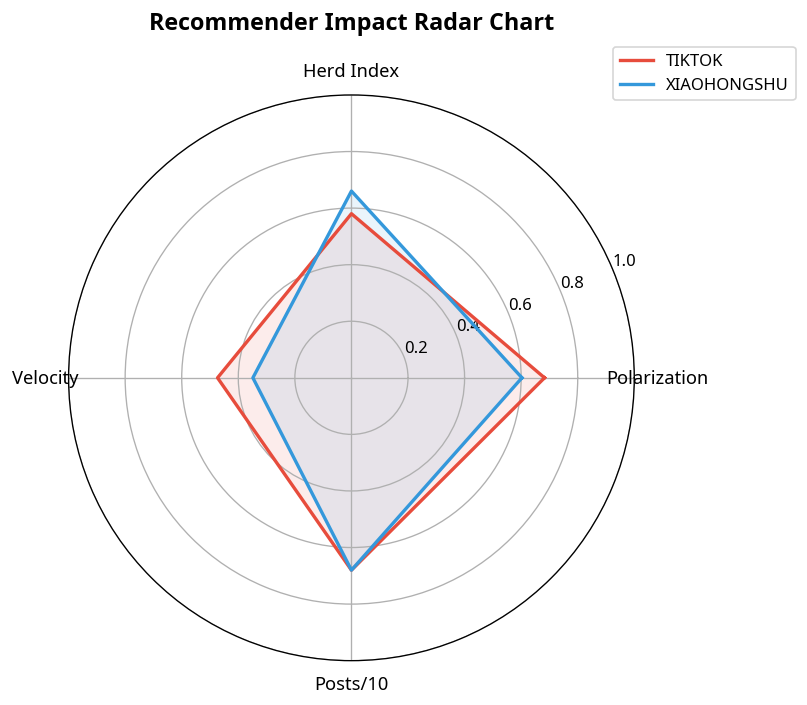

# R5-02 推荐策略影响对比分析报告

**实验 ID**：`exp_827ba93b`  
**数据集**：dataset_demo_reddit  
**平台**：REDDIT  
**步数**：15  

---

## 1. 核心指标汇总

| 推荐器 | 极化值（最终） | 羊群指数（最终） | 平均传播速度 | 总帖子数 |
|---|---|---|---|---|
| **TIKTOK** | 0.6826 | 0.5802 | 0.4734 | 34 |
| **XIAOHONGSHU** | 0.6028 | 0.6602 | 0.3484 | 34 |

---

## 2. 可视化对比

**图 1：极化曲线对比**

**图 2：羊群效应曲线对比**

**图 3：传播速度柱状图对比**

**图 4：综合指标雷达图**

---

## 3. 两两差异分析

### TIKTOK vs XIAOHONGSHU

| 指标 | TIKTOK | XIAOHONGSHU | 差值 (A-B) |
|---|---|---|---|
| 极化值（最终） | 0.6826 | 0.6028 | `+0.0798` |
| 羊群指数（最终） | 0.5802 | 0.6602 | `-0.0800` |
| 平均传播速度 | 0.4734 | 0.3484 | `+0.1250` |

**结论**：TIKTOK 策略下极化程度更高（差值 0.0798），说明其信息茧房效应更显著；XIAOHONGSHU 策略下羊群效应更强（差值 0.0800），内容集中度更高；TIKTOK 策略传播速度更快（差值 0.1250），新鲜内容扩散更迅速；综合来看，TIKTOK 与 XIAOHONGSHU 在社交动力学上存在可观察差异，推荐算法设计对平台生态有实质性影响。

---

## 4. 综合结论

在本次实验中，**TIKTOK** 策略产生了最高的极化效应，**XIAOHONGSHU** 策略极化最低。**XIAOHONGSHU** 策略下羊群效应最强，**TIKTOK** 策略下信息传播速度最快。

上述差异表明，推荐算法的权重设计对社交平台的信息生态具有显著影响：
短期兴趣权重越高，信息茧房效应越强，极化越严重；社交互动权重越高，内容集中度越高，羊群效应越明显；新鲜度权重越高，信息传播越迅速。

这一结论为平台设计者提供了可量化的参考依据，有助于在推荐效率与信息生态健康之间寻求平衡。